# AnimaLeague

<!-- START_SECTION: summary -->
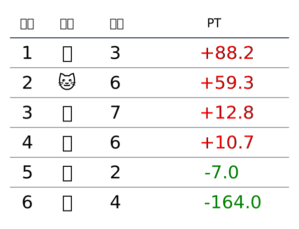
<!-- END_SECTION: summary -->

<!-- START_SECTION: day -->
## Day 1

### Round 1

### Round 2

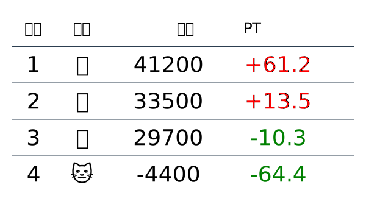

### Round 3

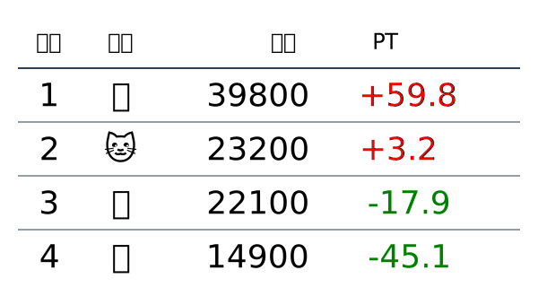

## Day 2

### Round 1

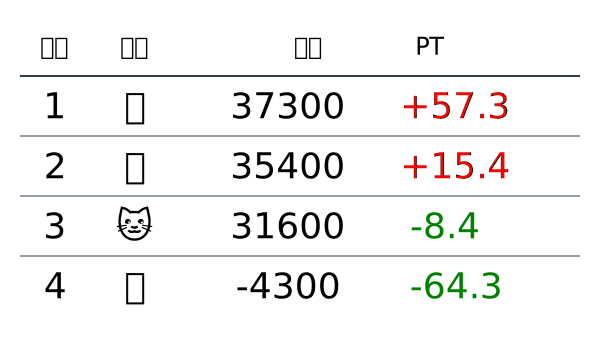

### Round 2

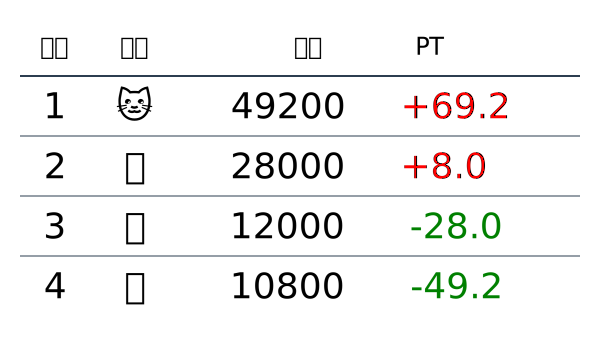

### Round 3

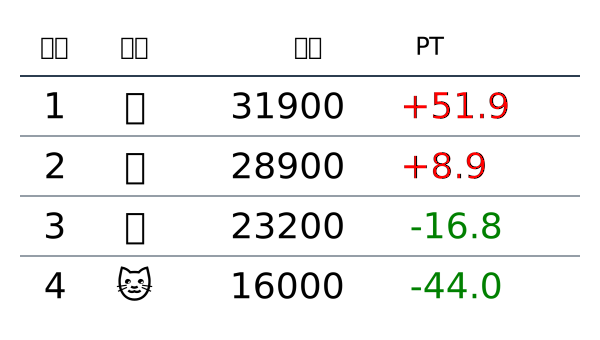

## Day 3

### Round 1

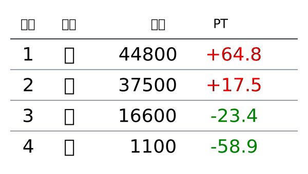

### Round 2

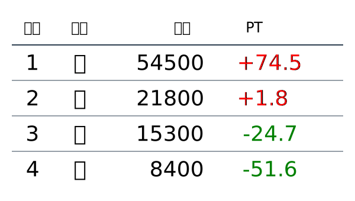

### Round 3

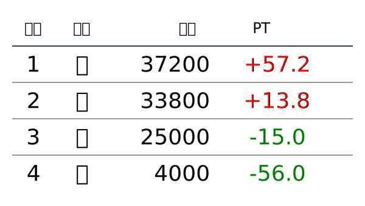

### Round 4

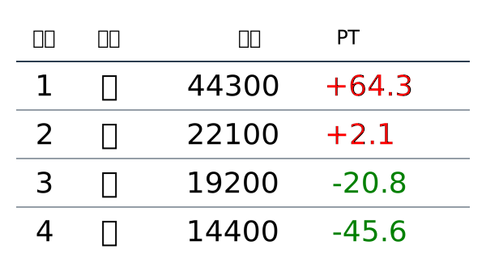

## Day 4

### Round 1

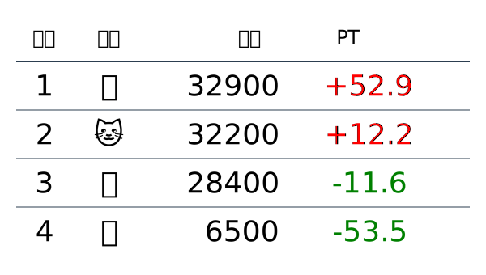

### Round 2

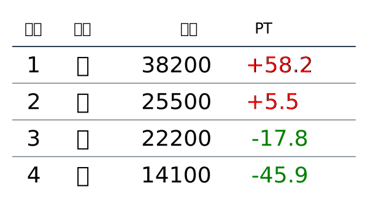

## Day 5

### Round 1

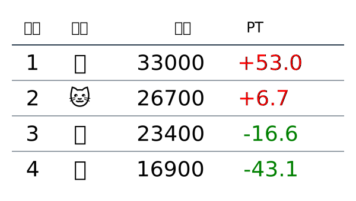

### Round 2

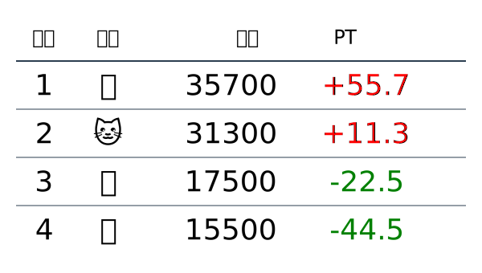

## Day 6

### Round 1

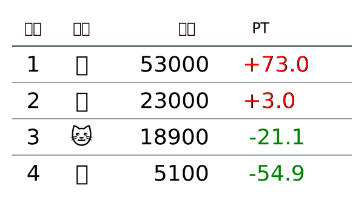

### Round 2

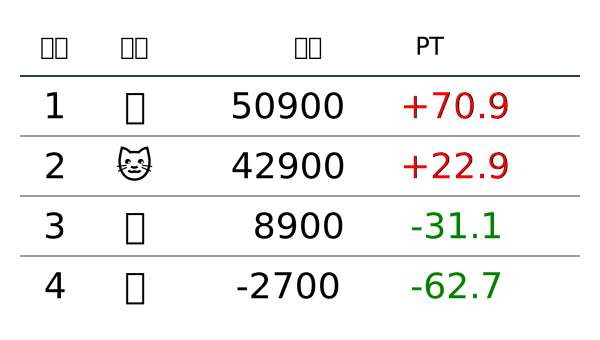

### Round 3

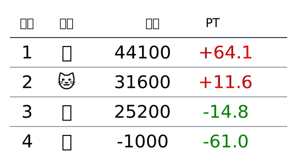

## Day 7

### Round 1

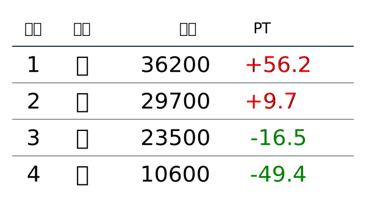
<!-- END_SECTION: day -->
