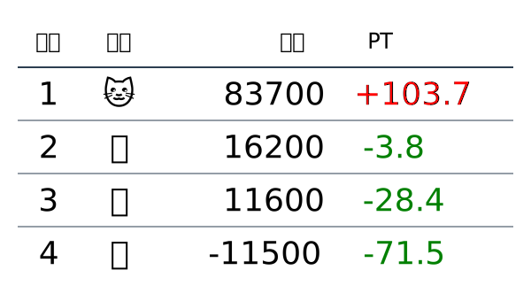

# AnimaLeague

<!-- START_SECTION: summary -->

<!-- END_SECTION: summary -->

<!-- START_SECTION: day -->
## Day 1

### Round 1

### Round 2

### Round 3

## Day 2

### Round 1

### Round 2

### Round 3

## Day 3

### Round 1

### Round 2

### Round 3

### Round 4

## Day 4

### Round 1

### Round 2

## Day 5

### Round 1

### Round 2

## Day 6

### Round 1

### Round 2

### Round 3

## Day 7

### Round 1

<!-- END_SECTION: day -->
